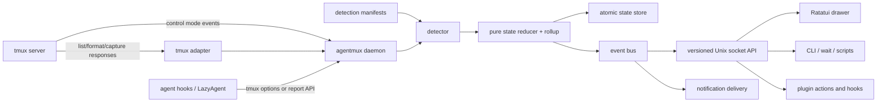

# agentmux 実装計画

最終更新: 2026-07-10  
機能基準: Herdr v0.7.3  
現行互換基準: dotfiles の Bash 版 agentmux (`1e4d5540`)

実装状況 (2026-07-11): P0 の Cargo/test/control-mode spike と、P1 の usable MVP を実装済み。Linux/tmux 3.7b で unit test、isolated tmux integration、実TUI captureを検証した。LazyAgent buffer ACPは`publish` / owner-safe `withdraw`でnative lifecycleを公開する。P1 の残りは Bash differential test の拡充、macOS/対応tmux下限のCI、install migrationである。

## 1. 目標

既存 tmux server 内の coding agent を、左側 drawer から横断的に発見、監視、操作できる単一 Rust binary を作る。

完成時の利用イメージ:

```tmux
bind -n M-a display-popup -E -x 0 -y 0 -w 42% -h 100% \
  "agentmux ui --client '#{client_name}' --origin '#{pane_id}'"
```

```bash
agentmux agent list --json
agentmux agent focus reviewer
agentmux agent send reviewer "run the failing tests"
agentmux agent wait reviewer --status done --timeout 120s
agentmux worktree create --session main --branch feature/auth
```

成功条件は次の3段階に分ける。

1. Rust 版が既存 Bash 版を無変更で置換できる
2. Herdr の中核である sidebar、正確な状態、rollup、CLI/API、wait、integration を tmux 上で満たす
3. [parity matrix](parity-matrix.md) の全行を implemented/native verified/adapted verified/excluded のいずれかにする

## 2. 実装境界

### 実装するもの

- command-invoked sidebar/drawer と live preview
- session/window/pane/agent/worktree の検索・操作
- process/screen/hook による agent 検出と semantic state
- `done = idle + unseen`、rollup、priority sort、通知
- daemon、versioned local API、events、wait、CLI、agent skill
- agent integration installer と native conversation resume
- Git worktree、snapshot、plugin host、remote helper
- 設定、theme、mouse、mobile、diagnostics、distribution

### tmux に委譲するもの

- PTY ownership と terminal emulation
- pane の実プロセス、scrollback、copy-mode
- server/session/window/pane の永続性
- split/layout/resize/zoom/move の実処理
- attach/detach、multi-client、通常の SSH remote workflow
- inner TUI への keyboard/mouse/OSC/Kitty graphics forwarding

### 対象外

- Herdr 独自 terminal renderer の再実装
- native Windows。WSL は対象
- Herdr のlogo、文章、音源などブランドassetのコピー
- Plugin の sandbox。任意 code を実行する拡張として明示する

## 3. 実装開始前の既定判断

未確定事項で停止しないため、計画上は次を既定値とする。P0 で変更可能である。

| 項目 | 既定判断 | 理由 |
| --- | --- | --- |
| UI | 左寄せ full-height tmux popup | 現在 layout を壊さず、command で呼び出せる |
| hierarchy | server/socket → session → window → pane | Herdr の session → workspace → tab → pane と一致 |
| platform | Linux、macOS、WSL | tmux backend と整合 |
| tmux minimum | 3.3a を暫定下限 | popup/control mode/format を利用。P0 matrix で確定 |
| Rust | stable toolchain を pin、MSRV を明記 | 現環境の nightly への偶然依存を避ける |
| packaging | 1 binary、1 Cargo package から開始 | 配布と起動を単純に保つ |
| API | Unix socket + newline-delimited JSON | CLI、hook、plugin、長寿命 subscription に適する |
| compatibility | 現行 CLI と `@agent_*` options を維持 | tmux binding と LazyAgent integration を壊さない |
| parity baseline | v0.7.3 を freeze | 進行中の Herdr master に scope を動かされない |
| license | AGPL-3.0-or-later | Herdr由来の検出エンジン・manifestと互換にする |

Herdr v0.7.3の検出エンジン・manifestを固定コミットから移植し、派生元を `NOTICE` に記録する。agentmux全体をAGPL-3.0-or-laterで扱う。

## 4. Architecture



### 4.1 Process model

`agentmux` は同じ binary で役割を切り替える。

- `agentmux ui`: popup 内 foreground TUI。daemon を ensure し API client になる
- `agentmux daemon`: tmux socket ごとに1つ。状態の唯一の writer
- `agentmux <resource> ...`: human/automation CLI
- `agentmux hook report ...`: integration 用の軽量 report path
- `agentmux plugin ...`: plugin registry/runner client

Daemon socket は `$XDG_RUNTIME_DIR/agentmux/<tmux-server-identity>.sock`、永続 data は `$XDG_STATE_HOME/agentmux/`、config は `$XDG_CONFIG_HOME/agentmux/config.toml` を既定とする。socket directory と file は current user のみに制限する。

### 4.2 Source layout

初期は crate 間 API を固定せず、1 package の library modules にする。

```text
src/
  main.rs
  lib.rs
  cli/             clap command、human/JSON formatter
  core/            ID、model、state reducer、rollup、target resolver
  tmux/            argv command、format parser、control client、capability probe
  detect/          process tree、screen snapshot、manifest、stabilizer、explain
  daemon/          lifecycle、snapshot scheduler、event bus、client registry
  api/             request/response/event schema、Unix transport、wait
  tui/             drawer、workspace tree、agent panel、preview、modal、mouse
  integration/     agent registry、install/uninstall/status、session resume
  worktree/        Git adapter、group metadata
  persist/         atomic snapshot、migration、plugin registry
  notification/    toast/terminal/system/sound
  plugin/          manifest、install/link、runner、context、logs
  remote/          SSH thin client/bootstrap
tests/
  fixtures/screens/
  fixtures/control-mode/
  integration/
```

将来、API schema または plugin SDK を別 package として配布する必要が生じた時だけ workspace crate に分割する。

### 4.3 依存候補

- `clap`, `clap_complete`: CLI
- `tokio`: daemon、Unix socket、process、timer、signal
- `ratatui`, `crossterm`: TUI
- `serde`, `serde_json`, `toml`, `schemars`: config/protocol/schema
- `regex`, `unicode-width`, `unicode-segmentation`: detection/UI
- `nix`: control-mode client 用 PTY と Unix process inspection
- `tracing`, `tracing-subscriber`, `tracing-appender`: diagnostics
- `thiserror`: typed error
- `tempfile`, `insta`, `proptest`: test

依存は P0 spike 後に確定する。tmux を shell string で呼ばず `std::process::Command`/`tokio::process::Command` の argv として実行する。

## 5. Domain model と protocol

### 5.1 Identity

- server: tmux socket path/name + server PID/start identity
- client: `#{client_name}`。focus/seen/notification は client 単位
- session: `$session_id`
- window: `@window_id`
- pane: `%pane_id`
- agent instance: server generation + pane ID + detected process generation

名前と index は表示・入力 alias であり canonical identity にしない。ID が server restart 後に再利用されても旧 metadata を誤適用しないよう generation を含める。

### 5.2 Agent state

内部 semantic state は次の4つとする。

```text
Idle | Working | Blocked | Unknown
```

表示上の `Done` は `Idle && !seen(client)`、`Dead` は pane/process lifecycle、`PlainPane` は agent 非検出の分類である。これにより Herdr と同じ「完了したが未確認」を正確に表現する。

既存 Bash CLI の明示的な `status ... done` は後方互換として受け付け、内部では `Idle + unseen` に正規化する。新しい lifecycle report API は `Idle/Working/Blocked/Unknown` を受け、`Done` を直接の永続 semantic state にはしない。

State record は最低限次を持つ。

```text
semantic_state
authority: lifecycle | screen | manual | process
source_id
agent_kind / agent_name
custom_status
message
changed_at / monotonic_seq
report_seq / process_generation
ttl / owner_pid
session_reference (restricted)
evidence summary
```

Rollup priority は `blocked > done > working > idle > unknown`。custom status と display metadata は semantic state、wait、rollup、notification を変更しない。

### 5.3 既存 tmux option protocol

P1 から以下を完全互換で読み書きする。

```text
@agent_kind
@agent_name
@agent_command
@agent_created_at
@agent_status
@agent_status_at
@agent_status_ttl
@agent_status_message
@agent_status_pid
@agent_status_owner
```

新しい field は `@agentmux_*` namespace で追加し、既存 integration を壊さない。Socket report が利用できない early-start/standalone hook の fallback として pane options を残す。

### 5.4 Local API

- NDJSON request/response、request ID、protocol version
- typed success/error envelope と stable error code
- initial snapshot と、それ以降の monotonically ordered event
- bounded subscriber queue。slow client は再snapshotを要求し、daemon 全体を止めない
- CLI は API の薄い wrapper
- `agentmux api schema --json` で JSON Schema を生成

Resource method は `server/session/window/pane/agent/worktree/layout/events/plugin/notification` に分ける。Herdr の capability は揃えるが、tmux target と response type を含む agentmux 独自 protocol とする。

## 6. tmux event strategy

現在の Bash 版のイベント駆動を退化させない。

1. Daemon が private PTY 上で tmux control-mode client を起動
2. `refresh-client -A` で必要 pane の output event を有効化
3. `%output` / `%extended-output` は pane dirty flag だけを立てる
4. preview refresh は burst を50ms coalesce、最大20Hz
5. detection/list snapshot は250ms coalesce、最大4Hz
6. session/window/pane/layout event は topology を即 refresh
7. format subscription は補助に使い、1秒 latency が許されない状態には依存しない
8. idle 時は timer polling しない。TTL/notification/manifest check の deadline timer のみ

P0 では `tmux -C/-CC` が pipe のみで安定するか、private PTY が必須かを検証する。必須なら `nix::pty::openpty` を binary 内で使い、現在の util-linux `script` 依存を除く。

Snapshot は1回の `list-panes -a -F` から topology/options/process hints を取得する。`capture-pane` は recognized agent、manual-marked pane、現在 preview 中の pane に限定する。

## 7. Phase plan

### P0 — 方針固定と技術 spike

Deliverables:

- repository/Cargo/CI/rust-toolchain/license の scaffold
- v0.7.3 feature freeze と parity matrix の issue/checklist 化
- tmux 3.3a、現行 stable、手元3.7bの capability probe
- private PTY control-mode prototype
- dedicated `tmux -L agentmux-test-*` integration harness
- current Bash output/control-mode/screen fixtures の採取
- config、ID、state、socket protocol の ADR

Gate:

- user の tmux server に触れず、test server の全 pane output/topology event を取得できる
- `script`, `fzf`, `curl` なしで Rust prototype が起動できる
- license と supported platform/minimum tmux が確定

### P1 — Bash 版の Rust 完全置換

Deliverables:

- `menu/list/preview/focus/spawn/send/mark/unmark/respawn/status/clear-status`
- current `@agent_*` option protocol と LazyAgent integration 互換
- process/TTY/manual mark の既存identity detectionと、識別後のscreen state detection
- status normalization、TTL、owner PID freshness
- agent-first ordering、source/last line、right-side preview
- Ratatui popup UI と現行 key actions
- 最小限の TOML config と安全な default
- 既存 `$XDG_CONFIG_HOME/tmux/scripts/agentmux` から binary への薄い wrapper または install path

Gate:

- Bash と Rust を同じ isolated tmux fixture に対して実行し、対象 pane、kind、state、sort が一致
- 現行 tmux.conf と LazyAgent Lua を変更せず動作
- idle CPU ほぼ0、preview 20Hz/list 4Hz の上限を維持
- 破壊操作に確認がある

Release candidate: `0.1`。この時点で日常利用を Rust へ切り替えられる。

### P2 — Daemon、state engine、正確な detection

Deliverables:

- tmux socket ごとの auto-start daemon と user-only Unix socket
- pure reducer、event bus、client/session/window/pane/agent model
- `Idle/Working/Blocked/Unknown + seen` model、rollup、state transitions
- process group/tree/wrapper detection、20 agent catalog
- versioned TOML screen manifest engine、bundled/local override
- authority arbitration、report seq/generation/TTL
- `agent explain` evidence output
- config validation/hot reload、atomic snapshot、rotating logs、status diagnostics
- detector stabilizer
  - configurable startup grace
  - weak working→idle confirmation
  - process miss threshold
  - unchanged-idle screen scan skip

Herdr の実績値である 300ms scan、3秒 grace、100ms×3 confirmation、最大700ms hold、5秒 process recheck、6 miss disappearance を最初の fixture baseline とし、tmux event-driven model に合わせて計測後調整する。

Gate:

- transcript 中の古い approval 文言で false blocked にならない
- background `working/blocked -> idle` が unseen done、対象を表示すると idle
- lifecycle authority 中に screen state が上書きしない
- invalid local manifest で daemon が落ちず bundled rule へ戻る
- daemon restart 後も tmux process を一切停止しない

### P3 — Herdr-style sidebar UX

Deliverables:

- expanded workspace tree + all-agent panel
- grouped/priority sort、custom name/status、Git summary placeholder
- expanded/compact/hidden、width、section divider、independent scroll
- responsive agent-first mobile view
- click/wheel/drag/context menus
- searchable session/window/pane navigator と state filters
- keybinding help、resize mode、theme/CJK width
- current client を保持する focus/seen semantics

Gate:

- 100 session / 500 pane / 100 agent の synthetic snapshot で操作 p95 50ms 以下
- 40/80/160 column golden snapshots
- mouse と keyboard の全操作に同じ command path を使う
- 別 tmux client の active window/focus を誤って変更しない

Release candidate: `0.2`。Herdr の中心的な triage UX が完成。

### P4 — CLI、API、events、wait

Current increment: `skills/agentmux` で tmux-native split/run/read と agentmux-native discovery/state/send を組み合わせるorchestration recipeを実装済み。pollingによる output/status wait も使用可能。daemon event subscriptionとrace-free wait APIは本phaseの残作業。

Deliverables:

- session/window/pane/agent CRUD と directional operations
- visible/recent/unwrapped/detection/ANSI read
- text/key/atomic run、move、swap、resize、zoom、process/cwd/layout
- custom state/session/display metadata report
- initial snapshot、event subscription、output/state wait
- JSON schema、human/JSON output、shell-safe target resolver
- agent skill と automation recipes

Gate:

- snapshot→subscribe 間で event loss がない
- slow subscriber が daemon/TUI/他 client を止めない
- timeout/cancel/disconnect で wait task が残らない
- ambiguous name/label は stable error code を返す
- API contract/golden schema test がある

Release candidate: `0.3`。Agent 自身が sibling pane を安全に orchestration 可能。

### P5 — 公式 agent integrations と native resume

Deliverables:

- install/uninstall/status/outdated-only
- lifecycle: Pi、OMP、Kimi、OpenCode、Kilo、Hermes、MastraCode
- session identity only: Claude、Codex、Copilot、Devin、Droid、Qoder、Cursor
- agent-specific config path/env、idempotent edit、backup/rollback
- session reference validation と resume command registry
- stale/duplicate/child-process report protection

Gate:

- temporary HOME fixture で install→reinstall→uninstall が他の user config を保持
- 各 agent event fixture が期待 authority/state/session ref になる
- session-only hook が semantic state authority を奪わない
- invalid/duplicate/stale ref は resume せず shell fallback

### P6 — Worktree、layout、snapshot restore

Deliverables:

- worktree list/create/open/remove/force、parent-child grouping
- branch/ahead/behind/dirty の非同期 cache
- session/window/pane layout export/apply
- UI width/filter/group/label/agent metadata の atomic snapshot
- tmux server restart 後の topology/cwd/command metadata restore
- opt-in bounded history restore と secret warning

Gate:

- bare repo、existing/new branch、dirty/untracked、space/CJK path の test
- close と checkout remove を混同しない。branch は削除しない
- partial write/crash から直前の有効 snapshot を読める
- schema version migration test
- 非空の tmux server へ暗黙 restore せず、衝突時は plan/confirm を要求

### P7 — Notifications、terminal streams、remote

Deliverables:

- delayed done/blocked notification、active-target suppression
- in-drawer/terminal/system delivery、done/request/custom sound
- notification target jump、per-agent policy
- read-only observe / single-writer control stream
- `--remote` SSH thin client、keepalive、version/capability check
- remote keybinding policy、named tmux socket/session
- optional local clipboard-image bridge

Gate:

- 同一 state refresh で通知を再発火しない
- delay 中に state が変われば通知しない
- terminal/system tool 不在でも core が非fatal
- network drop で remote tmux process が停止しない
- writable controller ownership/takeover を test

### P8 — Plugin host、settings、update、distribution

Deliverables:

- plugin manifest、local link、GitHub install、enable/disable/uninstall
- actions、event hooks、managed panes、link handlers、bounded logs
- config/state dirs、context/env injection、platform/min-version validation
- settings/onboarding/release notes UI
- remote manifest updates、version/update channel
- shell completion、checksummed Linux/macOS release、Homebrew/mise/Nix 方針

Gate:

- install 前に source/ref/commit/build/runtime command を提示
- plugin event loop/rate limit と log size 上限
- plugin failure が daemon を落とさない
- package manager install を self-update が上書きしない
- fresh machine smoke test

### P9 — Parity audit と hardening

Deliverables:

- parity matrix 全行の evidence link
- tmux version/Linux/macOS/WSL compatibility matrix
- 24時間 burst/idle/multi-client soak
- protocol/config/snapshot migration policy
- security audit、threat model、backup/recovery docs
- user migration guide と Bash fallback removal plan

Gate:

- matrix に未分類の行がない
- data loss/process kill/command injection の open critical issue がない
- rollback を含む install/upgrade path が再現可能

Release candidate: `1.0`。

## 8. Test strategy

### Unit

- status normalization、TTL、owner PID、sequence/generation
- done/seen と rollup priority
- target parsing/ambiguity
- tmux format/control-mode parser
- process tree matcher と word boundary
- screen manifest matcher/region/priority/fallback
- Git porcelain parser、path/branch slug
- config/default/validation/migration

### Fixture/golden

- agent ごとの idle/working/blocked/transcript-viewer screen
- ANSI、soft wrap、CJK、alternate screen、narrow pane capture
- control-mode output/topology/pause/continue event corpus
- 40/80/160 column Ratatui `TestBackend` snapshots
- API/schema/error response golden

### Real tmux integration

全 test は random socket の専用 server を使う。

```bash
tmux -L "agentmux-test-$PID-$RANDOM" -f /dev/null new-session -d
```

- create/rename/kill/move/split/resize/zoom
- 複数 session/window/pane と複数 client
- pane output burst と control-mode reconnect
- pane option round-trip と existing LazyAgent report
- caller client-specific focus
- daemon crash/restart と tmux process survival

### End-to-end

- Bash/Rust differential test
- popup key/mouse action→tmux result
- hook install/report/resume fixture
- worktree lifecycle
- plugin install/action/event/pane
- local/SSH remote smoke

### Non-functional

- fuzz: control-mode lines、manifest、API、tmux target
- soak: idle、high-output、500 pane、slow subscriber
- security: socket permission、argv injection、path traversal、plugin trust prompt
- performance regression benchmark

## 9. Performance budgets

| 指標 | 目標 |
| --- | --- |
| cold popup first paint | 150ms 以下 |
| warm popup first paint | 75ms 以下 |
| keyboard/mouse action p95 | 50ms 以下 |
| selected preview refresh | 最大20Hz、burst coalesce |
| heavy detection/list refresh | 最大4Hz |
| idle daemon CPU | 実質0に近い。deadline/event待機のみ |
| memory | 100 agent 通常利用で100MiB未満を初期目標 |
| snapshot write | debounce + atomic rename、main event loopをblockしない |

数値は P0/P1 benchmark で測定し、妥当でなければ理由と新しい budget を ADR に残す。

## 10. 主なリスクと対策

| リスク | 対策 |
| --- | --- |
| tmux control mode が PTY を要求 | P0で `openpty` prototype。外部 `script` に依存しない |
| transcript の古い文言による false blocked | live bottom、agent別region、strict blocker、fixture、explain |
| npm/node/wrapper/VM でprocessを見失う | process group/tree、TTY args、manual/env hint、hook authority |
| alternate screen/capture差 | source semantics を固定し実tmux fixtureで検証 |
| 複数 client のfocus/seen競合 | client IDを全 action context に含める |
| shell/target command injection | argv実行、canonical ID、曖昧target拒否、Git ref検証 |
| agent config formatの更新 | agent別versioned editor、backup、idempotency、fixture |
| Herdr が高速に更新 | v0.7.3をfreeze、以後は別backlogとして差分監査 |
| upstreamとのライセンス・由来が不明瞭 | AGPL適用、固定commitと移植fileをNOTICEへ記録、ブランドasset非流用 |
| plugin任意code | trust preview、明示confirm、source pin、権限を文書化 |
| remote scopeの肥大化 | SSH内利用を先に完成しthin clientはP7まで遅らせる |

## 11. 移行方針

1. Rust binary は最初から既存 subcommand と option protocol を受ける
2. dotfiles の script path は薄い `exec agentmux "$@"` wrapper にするか、tmux.conf を binary へ切り替える
3. `AGENTMUX_LEGACY=1` 等で一定期間 Bash 版へ戻せるようにする
4. 同じ isolated tmux snapshot に対する differential test を release gate にする
5. P1 の実利用期間後にのみ fzf/curl/script dependency を削除する
6. LazyAgent integration は socket report 対応を追加しても pane-option fallback を残す

## 12. 概算

1人で test/documentation を含めて進める場合の粗い目安であり、P0 spike 後に更新する。

| Phase | 目安 |
| --- | --- |
| P0 | 3〜5日 |
| P1 | 1〜2週 |
| P2 | 2〜3週 |
| P3 | 2〜3週 |
| P4 | 2〜3週 |
| P5 | 3〜5週 |
| P6 | 2〜3週 |
| P7 | 3〜4週 |
| P8 | 4〜6週 |
| P9 | 2〜3週 |

完全 parity はおよそ21〜33人週。日常利用可能な Rust replacement は P1、Herdr の中心体験は P3、agent orchestration API は P4 で到達する。Integration、remote、plugin marketplace までを最初の MVP に含めないことが、早く安全に置換する鍵である。

## 13. 最初の実装 batch

P0 承認後は次の順で着手する。

1. license、supported OS、tmux minimum、UI default の ADR
2. Cargo stable scaffold、fmt/clippy/test、Linux CI
3. isolated tmux test harness
4. control-mode + private PTY prototype
5. typed ID/model/status と current pane-option contract
6. one-shot `list-panes` snapshot parser
7. current Bash detection/status fixture の unit test 移植
8. `agentmux list --json` と differential test
9. Ratatui list/preview と popup binding
10. current CLI/actions、LazyAgent compatibility、performance gate

この batch では Herdr 全機能を同時に作り始めず、「既存 Bash 版より悪くない Rust 基盤」を最初の完成品にする。その上に P2 以降を積む。
